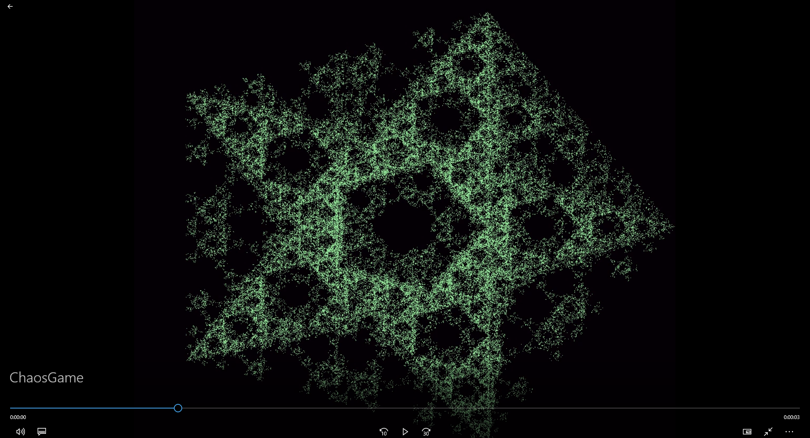

#Chaos Game

This is very simple showcase of **fractals**. In this project you will find many different
rulesets, which you can experiment with.

This project uses only **Accord.Video.FFMPEG library**, it's mainly used to compress neatly
generated pictures into video.

Everything is fully documented.

Here is simple showcase of generated video. (Every file is generated in the debug folder)

___

*Project has been created mainly for academic purposes (University Of Jan Evangelista Purkyně).*
